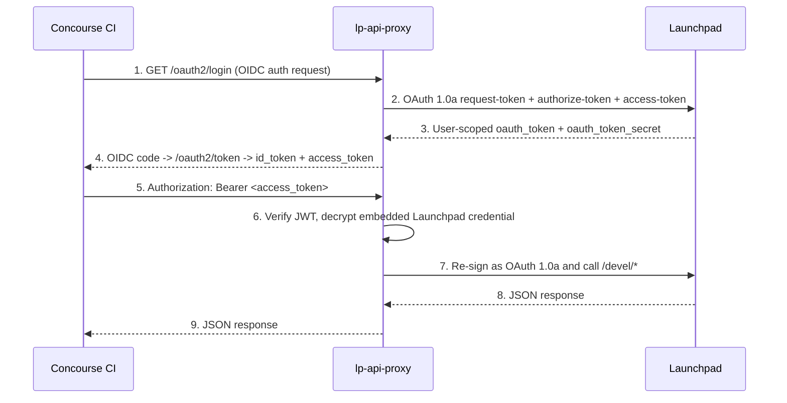

# Launchpad API Proxy

[](https://github.com/fourdollars/lp-api-proxy/actions/workflows/test.yaml)
[](https://charmhub.io/lp-api-proxy)
[](https://opensource.org/licenses/MIT)

`lp-api-proxy` is a lightweight OIDC Provider for clients such as Concourse CI.
It converts Launchpad OAuth 1.0a login into standard OAuth 2.0/OIDC tokens.
For Concourse CI setup details, see the
[Generic OAuth configuration guide](https://concourse-ci.org/docs/auth-and-teams/configuring/generic-oauth/).

## Quick start (local)

```bash
git clone --depth=1 https://github.com/fourdollars/lp-api-proxy.git
cd lp-api-proxy
uv sync --python 3.13
uv run gunicorn main:app -k uvicorn.workers.UvicornWorker -b 0.0.0.0:3456 -w 4
```

Then open:

- `http://localhost:3456/example.html`
- `http://localhost:3456/.well-known/openid-configuration`

## How it works



The proxy is stateless: it does not store user tokens in DB/Redis.
Per-user Launchpad credentials are encrypted inside `lp_cred` and carried in signed JWTs.

The OIDC `userinfo` response includes:

- `sub`
- `name`
- `profile`
- `groups` (Launchpad team names, e.g. `my-group`)
- `groups_full` (full Launchpad team URLs)

## OIDC endpoints (for Concourse)

- `GET /.well-known/openid-configuration`
- `GET /oauth2/jwks`
- `GET /oauth2/login`
- `GET /oauth2/callback` (internal callback endpoint)
- `POST /oauth2/token`
- `GET /oauth2/userinfo`

## Launchpad passthrough endpoints

- `POST /+request-token`
- `GET /+authorize-token`
- `POST /+access-token`
- `GET|POST|PATCH|PUT /devel/{api}`

`/devel/{api}` accepts:
- `Authorization: OAuth ...` (raw Launchpad OAuth 1.0a)
- `Authorization: Bearer <access_token>` (issued by `/oauth2/token`)

## Required environment variables

| Variable | Description |
| --- | --- |
| `PROXY_JWT_SECRET` | HS256 signing secret for internal/session/access JWTs. |
| `PROXY_JWT_ENCRYPTION_KEY` | Fernet key for encrypting embedded Launchpad credentials. |

## Optional environment variables

| Variable | Description |
| --- | --- |
| `PROXY_BASE_URL` | Public base URL (default: `http://localhost:3456`). |
| `PROXY_ALLOWED_ORIGINS` | Comma-separated origins used for CORS allowlist and dynamic Launchpad application naming (for example `http://ci.internal:8080,https://ci.example.com`). |
| `PROXY_RSA_PRIVATE_KEY` | RSA private key PEM for RS256 `id_token` signing. |
| `PROXY_OIDC_CLIENT_ID` | Expected OAuth client_id (default: `concourse-ci`). |
| `PROXY_OIDC_CLIENT_SECRET` | If set, `/oauth2/token` requires matching client_secret. |
| `LP_CONSUMER_KEY` | Launchpad OAuth 1.0a consumer key (default: `lp-api-proxy`). |
| `LP_CONSUMER_SECRET` | Launchpad consumer secret (typically empty for Launchpad). |
| `LP_SIGNATURE_METHOD` | `PLAINTEXT` (default) or `HMAC-SHA1`. |
| `PROXY_JWT_ISSUER` | Issuer claim override (default: `PROXY_BASE_URL`). |
| `PROXY_JWT_AUDIENCE` | Access-token audience (default: `concourse-ci`). |
| `PROXY_JWT_TTL_SECONDS` | Access-token lifetime (default: `2592000`). |
| `PROXY_CODE_TTL_SECONDS` | Authorization code lifetime (default: `120`). |
| `LOGIN_SESSION_TTL_SECONDS` | Login session token lifetime (default: `600`). |

## Local quick start example

```bash
export PROXY_BASE_URL='http://localhost:3456'
export PROXY_JWT_SECRET='replace-with-long-random-secret'
export PROXY_JWT_ENCRYPTION_KEY='replace-with-fernet-key'
export LP_CONSUMER_KEY='lp-api-proxy'
export PROXY_ALLOWED_ORIGINS='http://localhost:8080'

uv run --python 3.13 uvicorn main:app --host 0.0.0.0 --port 3456 --reload
```

## Deploy with Juju machine charm

Deploy from CharmHub edge channel:

```bash
juju deploy lp-api-proxy --channel edge
```

Or deploy this repository path directly:

```bash
juju deploy -m cci --base ubuntu@24.04 /path/to/lp-api-proxy lp-api-proxy --to 0
```

Recommended config for Concourse running on the same machine:

```bash
juju config -m cci lp-api-proxy \
  proxy-base-url=http://localhost:3456 \
  allowed-origins=http://localhost:8080 \
  proxy-oidc-client-id=myclientid \
  proxy-oidc-client-secret=myclientsecret
```

For public access from other hosts, set `proxy-base-url` to a reachable unit URL
(for example `http://<unit-ip>:3456`) instead of `localhost`.

## Concourse group authorization

You can use Concourse team group mapping directly:

```bash
CONCOURSE_MAIN_TEAM_OAUTH_GROUP=my-group
```

Because `userinfo.groups` contains Launchpad team names, Concourse can match
`my-group` without additional claim transformation.
